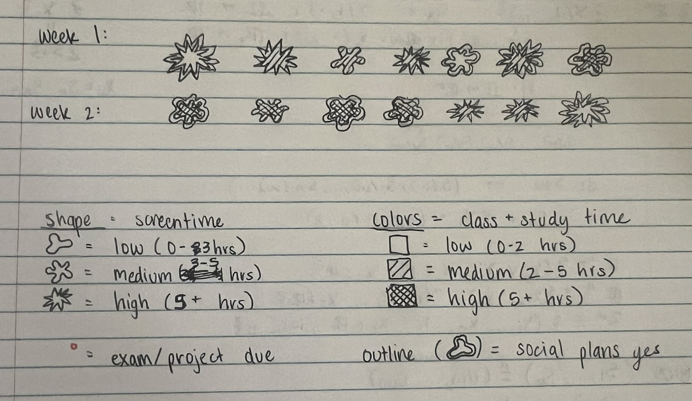
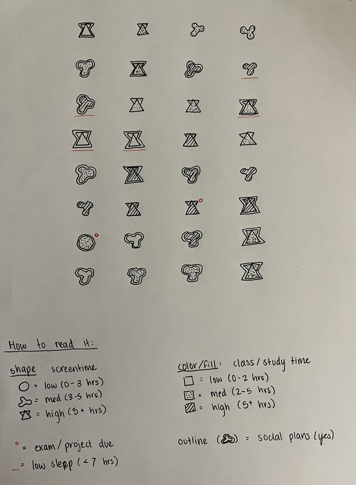
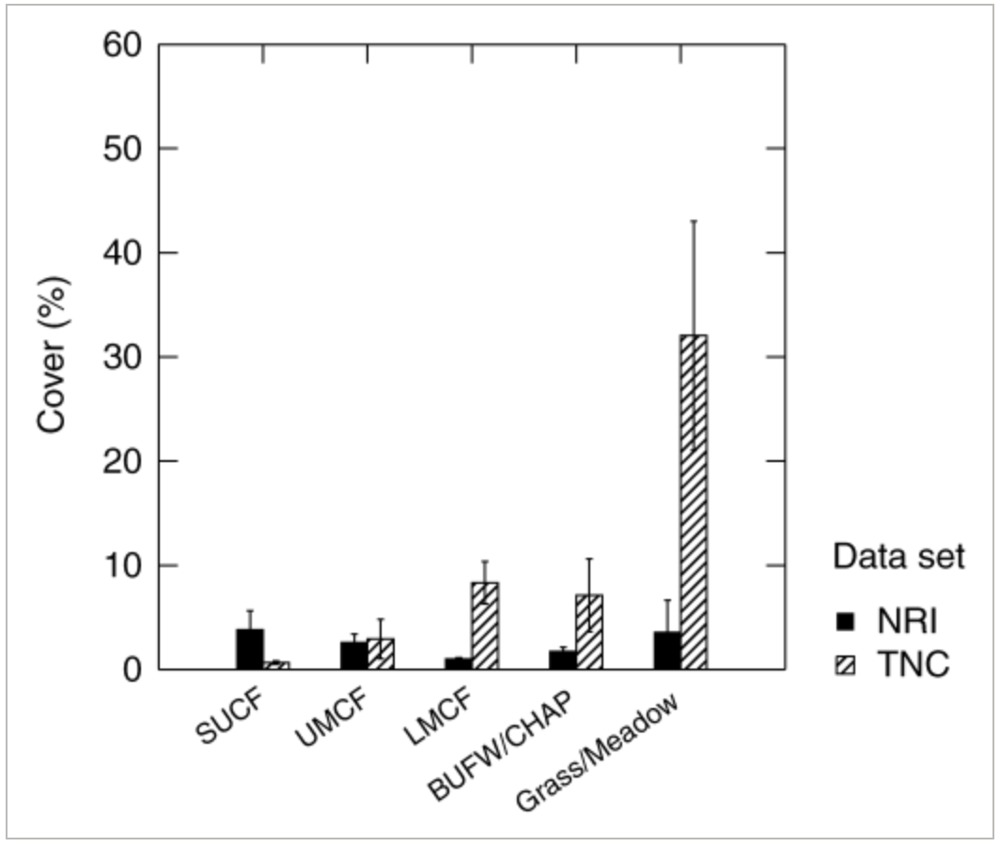

[Link to Github repository](https://github.com/sumaiyaalvi/ENVS-193DS_homework-03.git)


# Set up tasks

```{r}
#| label: load packages and data
#| message: false
library(tidyverse) #general use
library(here) #file organization
library(janitor) #cleaning data frames
library(readxl) #reading excel files


salinity <- read_csv(
  here( #allows you to write in file paths
    "data", #folder
    "salinity-pickleweed.csv" #salinity data
  ))

screentime <- read_csv(
  here( 
    "data", #data folder
    "screentime.csv" #personal data 
  ))
```
# Problem 1: Slough soil salinity

## a. An appropriate test

The appropriate tests to determine the strength of the relationship between California pickleweed biomass and soil salinity are Pearson’s correlation ($r$) and Spearman’s rank correlation ($\rho$), since both variables are continuous. Pearson’s r measures the strength and direction of the linear relationship between salinity and biomass. Spearman’s rank correlation measures the strength of a monotonic relationship between the variables and can be used when the assumptions of Pearson’s correlation, such as normality or linearity, are not met.

## b. Create a visualization

```{r}
#| label: salinity and biomass scatter plot

#base layer: ggplot
ggplot(data = salinity,
       aes(x = salinity_mS_cm,
           y = pickleweed)
       ) +
  #first layer: adding scatter plot points to represent individual pickleweed plants
  geom_point(color = "#3b7ea1") +
  #labelling the x and y axes
  labs(
    title = "As soil salinity increases, pickleweed biomass also increases",
    x = "Soil salinity (mS/cm)",
    y = "California pickleweed biomass (g)"
  ) +
  #changing the theme from the ggplot default
  theme_classic()
```

## c. Check your assumptions and run test

### Checking assumptions for Pearson's $r$ correlation

**Assumption 1: Linearity**

Linearity was assessed using the scatterplot created in 1b. The scatterplot shows a roughly straight-line pattern between soil salinity (mS/cm) and California pickleweed biomass (g), indicating that the linearity assumption is reasonably met.

**Assumption 2: Continuous variables**

Both variables used in the analysis are continuous. Soil salinity is measured as electrical conductivity in mS/cm, and pickleweed biomass is measured in grams.

**Assumption 3: Normality of variables**

```{r}
#histogram of soil salinity
ggplot(salinity, aes(x = salinity_mS_cm)) +
  geom_histogram(fill = "#3b7ea1", bins = 6) +
  labs(
    title = "Distribution of soil salinity",
    x = "Soil salinity (mS/cm)",
    y = "Count"
  ) +
  theme_light()

#histogram of pickleweed biomass
ggplot(salinity, aes(x = pickleweed)) +
  geom_histogram(fill = "#3b7ea1", bins = 6) +
  labs(
    title = "Distribution of pickleweed biomass",
    x = "Pickleweed biomass (g)",
    y = "Count"
  ) +
  theme_light()
```
**Assumption 4: Independent observations**

The observations represent different sampling locations in the study area, so they can reasonably be considered independent.

I checked the assumptions of linearity and approximate normality for Pearson’s correlation. Linearity was assessed using the scatterplot created earlier, and normality was evaluated using histograms of soil salinity and pickleweed biomass. The scatterplot suggests a roughly linear relationship, and the histograms show no extreme skew, so the assumptions appear reasonably satisfied for using Pearson’s r. The observations are also independent, and the variables are continouous.

### Running the test (Pearson's correlation)

```{r}
cor.test(salinity$salinity_mS_cm, salinity$pickleweed,
         method="pearson")
```

## d. Results

**Which test you used and why**
To evaluate the strength of the relationship between California pickleweed biomass (g) and soil salinity (mS/cm), I used Pearson’s correlation because both variables are continuous and I wanted to measure the strength and direction of their linear association.

**Interpretation of the test**
The results show a moderate positive relationship, meaning that higher soil salinity tends to be associated with greater pickleweed biomass (Pearson’s r = 0.53, t(21) = 2.90, p = 0.0086). This suggests that as soil salinity increases, pickleweed biomass generally increases as well.

## e. Test implications

Based on the results, pickleweed biomass tends to increase as soil salinity increases, which suggests that this species might perform better in more saline areas of the site. Since salinity explained about 29% of the variation in biomass, it seems like salinity is an important factor for planting success, although other factors are also likely influencing growth. For restoration planning, this means we may want to prioritize planting pickleweed in areas with higher salinity levels, while still considering other environmental conditions that could affect survival and growth.

Based on the results, pickleweed biomass tends to increase as soil salinity increases, indicating a moderate positive association between the two variables. This suggests that areas with higher soil salinity may generally support greater pickleweed biomass at the site. For restoration planning, this means that planting pickleweed in more saline areas may improve planting success, although other environmental factors likely also influence growth.

## f. Double check your own work

```{r}
#conducting Spearman rank correlation test between soil salinity and pickleweed biomass
cor.test(salinity$salinity_mS_cm,
         salinity$pickleweed,
         method = "spearman")
```

Spearman’s rank correlation measures the strength and direction of a monotonic relationship between soil salinity (mS/cm) and pickleweed biomass (g) using ranked values of the variables. The Spearman test also showed a significant positive association between salinity and biomass (Spearman’s $\rho$ = 0.59, p = 0.0034). Because both Pearson’s correlation ($r$ = 0.53, p = 0.0086), which tests linear association, and Spearman’s correlation, which tests monotonic association, are significant and positive, both tests would lead to the same decision to reject the null hypothesis of no relationship between soil salinity and pickleweed biomass.

# Problem 2: Personal data

## a. Updating your visualizations

### Visualization 1: visualizing screen time across days of the week
```{r}
#finding most recent observation date
most_recent_date <- max(screentime$Date)

ggplot(data = screentime, #starting with my dataframe
       aes(x = `Day of Week`, #x-axis: categorical variable
           y = `Screen Time (hours)`, #y-axis: response variable
           color = `Day of Week`)) + #coloring by day of week
  geom_jitter(width = 0.15, #adding horizontal jitter
              alpha = 0.7, #making points slightly transparent
              size = 2) + #point size
  labs(
    x = "Day of Week",
    y = "Screen Time (hours)", #changing axes labels
    title = "Screen time by day of the week", #title summarizing main message,
    #subtitle for most recent observation
    subtitle = paste("Most recent observation:", most_recent_date)
  ) + 
  scale_color_manual( #changing colors from default
    values = c("Monday" = "firebrick",
               "Tuesday" = "darkorange",
               "Wednesday" = "yellow3",
               "Friday" = "green3",
               "Saturday" = "blue4",
               "Sunday" = "slateblue4")
  ) +
  theme_light() + #changing theme from default
  theme(legend.position = "none") #removing legend
```

### Visualization 2: Screen time vs. Study time
```{r}
ggplot(data = screentime,
       aes(x = `Class + Study time (hours)`, #x-axis: continuous predictor
           y = `Screen Time (hours)`)) + #y-axis: response variable
  geom_point(color = "darkorange", #changing color from default
             size=2, #point size
             alpha=0.8) + #adding transparency
  labs(
    x = "Class + Study Time (hours)", #labelling axes
    y = "Screen Time (hours)",
    #title summarizing main message
    title = "Relationship between class/study time and screen time",
    #subtitle for most recent observation
    subtitle = paste("Most recent observation:",
                     most_recent_date)
  ) + 
  theme_light() #using different theme from default
```

## b. Captions

**Figure 1.** Screen time (hours) across days of the week. Each point represents one daily observation, showing variation in screen use depending on the day. Screen time appears somewhat higher and more variable on weekends compared to some weekdays, suggesting that daily schedule may influence overall screen use.

**Figure 2.** Relationship between class/study time (hours) and screen time (hours). Each point represents one day of observations. The scatterplot shows how screen time varies across different amounts of class and study time, with no strong pattern immediately visible.

# Problem 3: Affective visualization

## a. Describe in words what an affective visualization could look like for your personal data

An affective visualization of my personal screen time data could focus on showing how different days could have been overwhelming based on what I had going on in the day (studying for midterms, dealing with a busy schedule, etc.) and how it would have felt and impacted my screen time rather than just showing numerical patterns. For example, I could make a visualization similar to Giorgia Lupi's "A week of goodbyes" visualization which would have a different shape for low to high hours on my phone, different colors for how much study/class time I had that day, an additional figure in the corner to represent whether I had an upcoming exam, or another additional symbol to show whether I had social plans. 

## b. Create a sketch (on paper) of your idea.



## c. Rough draft



## d. Write an artist statement

* **Content** This piece visualizes 32 days of my life from January 11 to February 28, tracking my screen time alongside class/study workload, sleep, social plans, and major academic deadlines. Each symbol represents one day in chronological order, allowing the viewer to see how different life factors overlap across time. Rather than focusing on one variable, the piece shows how busyness and screen time exist within a larger context of daily habits.
* **Influences** I was inspired by Giorgia Lupi and Stefanie Posavec’s Dear Data project, especially their “Week of Goodbyes,” which uses hand-drawn symbols to encode personal experiences. Their work influenced my decision to create a symbolic system and to treat data as something personal and reflective. 
* **Form** This work is a hand-drawn data visualization created using pen on paper. The grid format organizes the days chronologically, while variations in shape and fill communicate different levels of intensity. I think that the hand-drawn, imperfect quality of the drawing reinforces the personal nature of the data.
* **Process** I first experimented with shapes that visually suggested different levels of intensity for screen time. Then, I designed fills to become denser on busier academic days, and added small annotations to indicate low sleep or major deadlines. Creating the piece manually required me to slow down and reflect on each day individually

## e. Prep your materials to share in class.

[View slides here](https://docs.google.com/presentation/d/1sdk43z4pUdYA65hGB7Zwmkd2F6LeWfc7S1Y1Jhuh4nw/edit?usp=sharing)

# Problem 4: Statistical critique

## a. Revisit and summarize

The statistical test that the authors used is ANOVA. One response variable they tested was non-native species richness or percent cover of non-native species, and the predictor variable was a categorical group, such as vegetation formation (type of plant community) or whether the area was burnt vs. unburnt. ANOVA helps the authors answer their main question by testing whether the average amount of invasion by non-native plants is different across groups, such as burnt vs. unburnt areas or different vegetation formations. If the ANOVA result were significant, they would interpret it as evidence that the groups being compared have meaningfully different mean invasion levels, meaning fire status or vegetation type are associated with more (or less) non-native plant presence.



## b. Visual clarity

The figure displays vegetation formations on the x-axis and percent cover of non-native species on the y-axis, which is a sensible orientation because it compares invasion levels across categorical habitat types. The use of side-by-side bars allows clear comparison between the two datasets (NRI shown as solid black bars and TNC shown as hatched bars), and the error bars provide information about variability around the means. However, because the figure only shows summary statistics (bar heights and error bars) and does not display individual data points, it is difficult to assess the spread or overlap of observations within each vegetation type.Overall, the visualization effectively communicates the main statistical comparison, but additional detail would improve transparency.

## c. Aesthetic clarity

The figure handles visual clutter pretty well, since it uses simple bars, limited color (solid black and hatched fill), and minimal background elements. The absence of grid lines and excessive labeling keeps the focus on the bar heights and error bars, which represent the main data. One point of contention is that the large difference in scale for the Grass/Meadow category visually dominates the figure, which may distract from more subtle differences among the forest types (however that's just a reflection of the data, and not a stylistic choice the authors made). 

## d. Recommendations

One recommendation would be to include individual data points overlaid on the bars (like jittered points) so readers can see the distribution within each vegetation formation, rather than only the group means. I would also clarify what the error bars represent (e.g., standard error or confidence intervals) directly in the figure caption to improve transparency. These changes could improve clarity while maintaining the overall structure of the figure.


